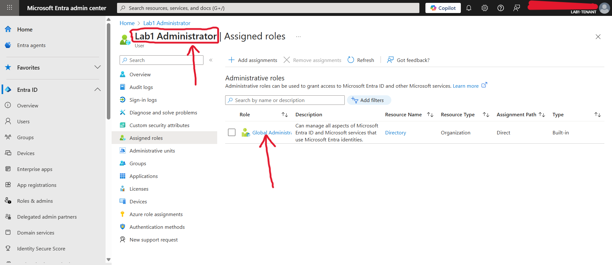
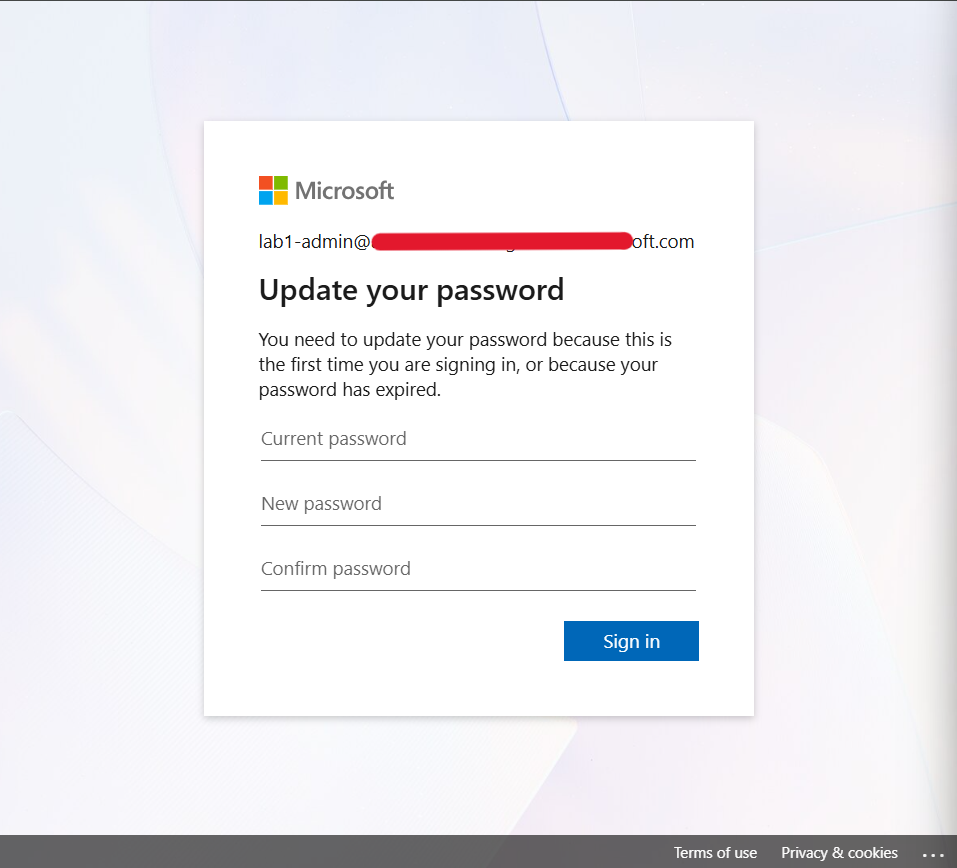
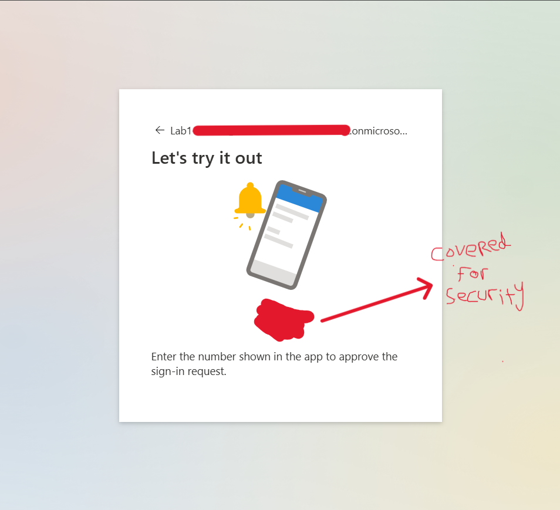
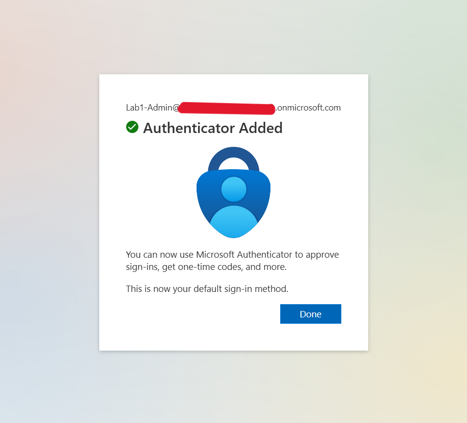
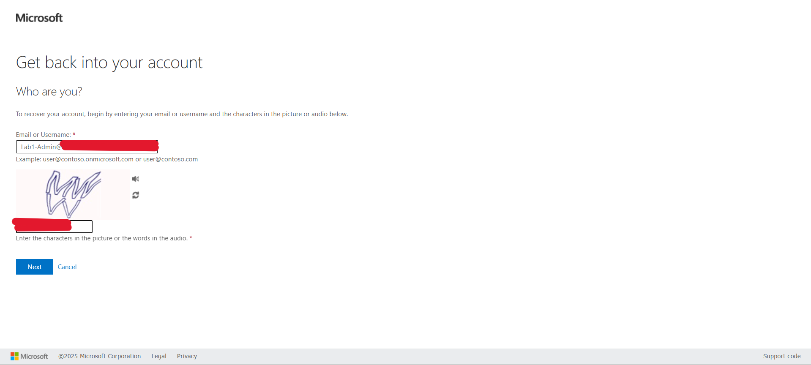
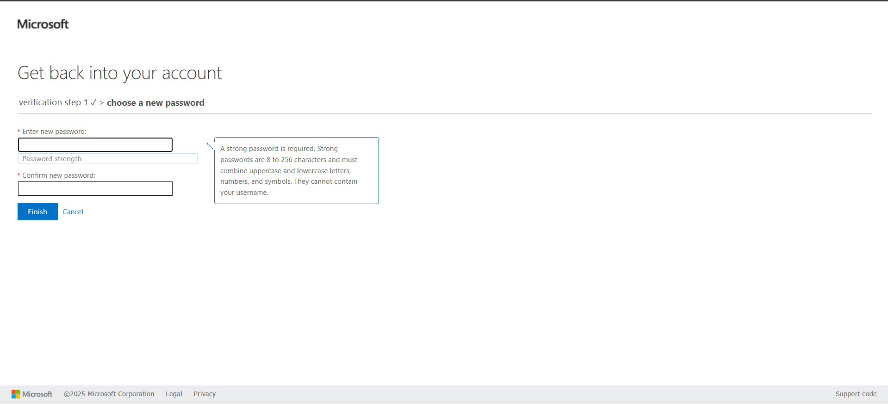

# Microsoft Entra ID Tenant Deployment (Lab 1)

## Overview
This lab focuses on deploying and configuring a new Microsoft Entra ID (Azure AD) tenant to support cloud identity management. The goal is to build a foundational understanding of tenant structure, user management, authentication policies, and self-service features.

**Lab Identifier:** Lab1  
**Tenant Name:** Lab1-Tenant  
**License:** Microsoft Entra ID Free  

---

## Objectives
1. Deploy a new Entra ID tenant and rename it.
2. Create a privileged admin account for lab operations.
3. Assign Global Administrator permissions.
4. Configure MFA using Microsoft Authenticator.
5. Enable and test Self-Service Password Reset (SSPR).

---

## Step 1: Tenant Creation and Configuration
- A new Entra ID tenant was provisioned and renamed from **Default Directory** to **Lab1-Tenant**.
- The default domain `ADAMMUKDAD97GMAIL.onmicrosoft.com` was retained.

---

## Step 2: Creating and Assigning Administrator Account
The following admin account was created to manage Lab1-Tenant:

- **User Principal Name:** Lab1-Admin@ADAMMUKDAD97GMAIL.onmicrosoft.com  
- **Display Name:** Lab1 Administrator  
- **Role:** Global Administrator  

### Screenshot 1: Global Administrator Role Assignment

*The Lab1 Administrator account is granted the Global Administrator role to manage all Entra ID resources.*

---

## Step 3: Initial Login and Password Update
When logging in for the first time, the Lab1 Administrator was prompted to change the temporary password.

### Screenshot 2: First Login Prompt

*The Lab1 Administrator updates the password during initial sign-in for security compliance.*

---

## Step 4: Multi-Factor Authentication (MFA) Setup
After the password update, MFA was configured using the Microsoft Authenticator app for enhanced account protection.

### Screenshot 3: Setting Up Microsoft Authenticator

*The Lab1 Administrator configures MFA through the Authenticator app for secure sign-ins.*

### Screenshot 4: MFA Setup Complete

*MFA was successfully added and set as the default sign-in method.*

---

## Step 5: Self-Service Password Reset (SSPR) Configuration
The Self-Service Password Reset feature was enabled to allow users to reset their passwords securely.

### Screenshot 5: Password Reset Portal

*The Lab1 Administrator accesses the password reset portal to verify the SSPR configuration.*

### Screenshot 6: Password Reset Completion

*The password reset process completes successfully, confirming that SSPR is working as intended.*

---

## Summary of Achievements
- ✅ Microsoft Entra ID tenant deployed and renamed to **Lab1-Tenant**.
- ✅ Lab1 Administrator account created and assigned Global Administrator role.
- ✅ MFA and SSPR successfully configured and tested.
- ✅ Environment ready for integration with on-prem Active Directory in future labs.

---

## Next Steps
Proceed to **Lab 2: Group and User Management in Microsoft Entra ID**, where you will:
- Create and organize users into groups.
- Apply administrative units.
- Begin enforcing Conditional Access policies.

---

*End of Lab 1 – Microsoft Entra ID Tenant Deployment*
